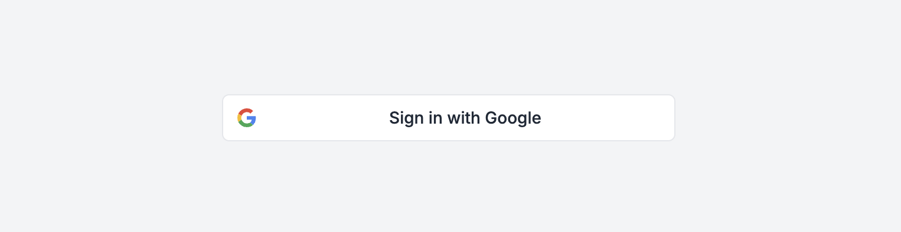
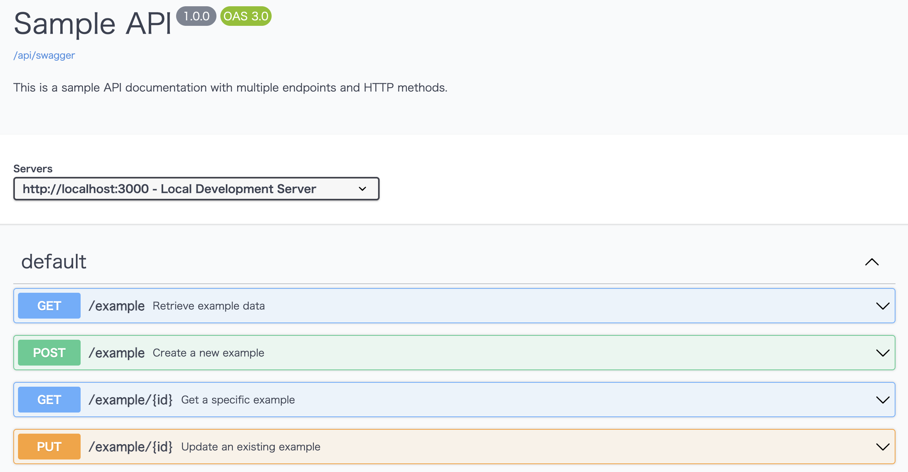
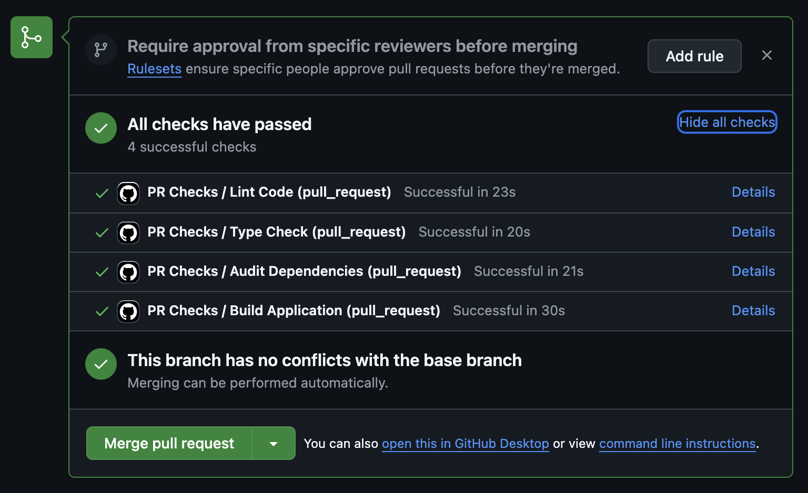

# Company Access Control Swagger UI (In Progress)

This application is designed for **authenticated users** (via company IP-based access control or Google OAuth) to view and interact with **Swagger documentation** stored in a file storage system. 

**Note**: The logic for fetching Swagger files from the file storage system has not been implemented yet. This application is a **work in progress** and is subject to further testing and refinement.

---

## Features (Planned and 90% Implemented)

- **IP-Based Authentication**: Only users from whitelisted IP addresses can access the app without additional authentication.
- **Google OAuth Authentication**: Non-whitelisted IPs require login using a Google account that is pre-approved.
   

- **Swagger UI Integration**: The app will display Swagger documentation from a file storage system (logic not yet implemented).
   

---

## Installation

### Prerequisites

1. **Node.js**: Ensure Node.js version `>= 20.0.0` is installed.
2. **Google Cloud Project**:
   - Enable the OAuth 2.0 API.
   - Obtain a `client_id` and `client_secret`.
3. **Company IP List**: Prepare a list of allowed IP addresses.
4. **Environment Variables**: Configure the `.env` file with required variables.

### Steps

1. Clone the repository:
```bash
git clone https://github.com/Cosmo2357/remix-swagger-ui.git
cd remix-swagger-ui
```

2. Install dependencies:
```bash
npm install
```

3. Create a .env file
```bash
GOOGLE_CLIENT_ID=your_google_client_id
GOOGLE_CLIENT_SECRET=your_google_client_secret
GOOGLE_JWKS_URL=https://www.googleapis.com/oauth2/v3/certs
USE_GOOGLE_AUTH=true
ALLOWED_IPS=127.0.0.1,192.168.1.1
ALLOWED_EMAILS=your-email1@example.com,your-email2@example.com
```

4. Start the development server:
```bash
npm run dev
```

Authentication Flow
### 1. IP-Based Access
If the user's IP address matches an entry in the ALLOWED_IPS list, they are granted access without further authentication.
Users from an unapproved IP address are redirected to the Google Login page.
### 2. Google OAuth Authentication
Users are redirected to Google for authentication.
After successful authentication, the app verifies the user's email against the ALLOWED_EMAILS list.
Only approved users can access the application.
### 3. Swagger UI
After successful authentication, the app will render Swagger documentation stored in a file storage system (logic for this is not yet implemented).

## File Structure
```bash
company-access-control/
├── app/
│   ├── routes/
│   │   ├── _index.tsx               # Swagger UI page
│   │   ├── login.tsx                # Login page with Google OAuth button
│   │   ├── auth.google.tsx          # Redirect to Google OAuth
│   │   ├── auth.google.callback.tsx # Handle Google OAuth callback
│   ├── utils/
│   │   ├── config.ts                # App-wide configuration and constants
│   ├── styles/
│   │   ├── tailwind.css             # Tailwind CSS file
├── public/
├── remix.config.js                  # Remix configuration
├── tailwind.config.js               # Tailwind CSS configuration
├── package.json                     # Dependencies and scripts
```

# Basic Github Actions Check
   

